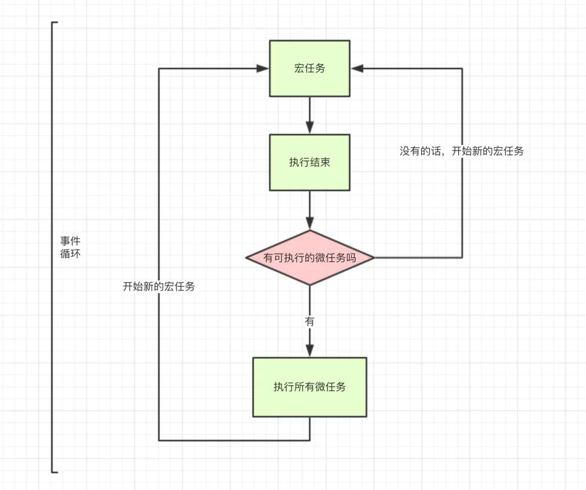
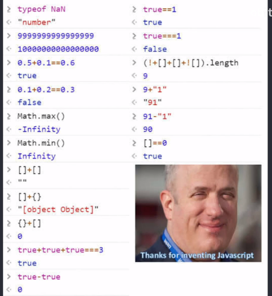

## 入门
#### TypeScript就是一个js的超集，主要提供了类型系统和对ES6的支持，它由Microsoft开发，代码发布在gitHub上开源
* TypeScript有一些优点也有一些缺点，所以可以自行选择是否要使用这个
* 优点在于
```
1.TypeScript增加了代码的可读性和可维护性，大部分函数看看类型的定义就可以知道如何使用了，可以再编译的过程中就发现错误
这总比运行的时候发生错误要好得多，增强了编辑器的IDE功能，包括代码补全、接口提示，跳转定义等
2.TypeScript包容性很强，.js文件可以直接重新命名为.ts，即使不做出显示的类型也能自动做出类型判断

//注意 注意 注意 即使Typescript编译报错，也可以生成js文件
//如果发生报错，还是会生成js文件，这个文件还是可以用的
//如果希望在报错的时候终止对js文件的生成，可以在tsconfig.json 中配置 noEmitOnError 即可。关于 tsconfig.json，请参阅官方手册（中文版）。
```
* 有一定的缺点
```
1.有一定的学习成本，要理解接口（Interfaces）、泛型（Generics）、类（Classes）、枚举类型（Enums）等前端工程师可能不是很熟悉的概念
2.可能和一些库的结合不是那么完美
3.集成到构建流程需要一些工作量
4.短期可能要增加一些开发成本，因为要写一些类型的定义，不过对于一个长期维护的项目，TypeScript能够减少其工作量
```
#### 初步认识TypeScript
* 首先typeScript可以在每一个值声明的时候给予类型判定
* 可以是原始数据类型:布尔值、数值、字符串、null、undefined
```
//以下是对于类型声明的基础用法
let test1 : boolean = false;
let test2 : number = 123;
let test3 : string = "Tom";
let test4 : null = null;
let test5 : undefined = undefined;
//如果声明了数据类型之后修改则会报错
test1 = 222
// 报错信息 typeS.ts(5,1): error TS2322: Type '123' is not assignable to type 'string'.

```
* JavaScript没有空值的概念，在TypeScript中，可以使用void表示没有返回值的函数
```
function alertName():void{
	alert("测试一下")
}
```
* 注意 注意 注意 如果是单纯的let xxx;会被理解成声明了一个任意值 就是下面会说到的any
```
//例如
let test1 : string= "123"
let test1 = 123 //则会报错，因为更改了数据类型

//如果是声明的任意值则不会报错
let test1:any = "hello"
test1 = 123  

//也可以访问到任意值上的对象
test1.setName("Tom")

//有更加简洁的写法，
let test1;
test1 = 123
test1 = "123"
test1.setName("Tom") //都不会报错
```
* 因为有些数据是需要两种数据类型的，从而引进了联合数据类型，可以设置多个类型的声明
```
let test1 : string|number;
test1 = "这是个啥"
test1 = 123
//这样都是不会报错的除非使用了两个类型中都没有的类型
test1 = false //报错
```
* 在访问联合数据类型的属性和方法时，只能访问他们共有的属性和方法，如果另一个属性类型没有这个方法或属性则会报错
```
//这里的参数是something和getLength函数的返回值的共有属性并没有length 所以会报错
function getLength(something: string | number): number {  
    return something.length;
}
```
```
//但是如果是toString则都是有的，所以不会报错
function getString(something: string | number): string {
    return something.toString();
}
```
* 当一个属性被赋值之后，会根据类型推断的规则判断出一个类型
* 从而可以实现调用属性
```
let test:string|number;
test = "我是谁，我在哪，我在干嘛"
console.log(test.length)  //12
test = 123
console.log(test.length)  //编译的时候报错
```
#### Interfaces接口，也称为对象类型
* 定义一个接口就是类似于定义一个对象里的数据类型，并且还有规定对象里数据的数量
* 接口的名字一般采用大写字母做开头
```
interface Test {  //声明一个接口，下面是每个key对应的值所能用的类型
    name: string;
    age: number;
}
let tom : Test = {
    name : "陈",
    age : 23
}
console.log(tom)
```
* 如果相应的key值对应的value值类型不一样，或者说有多出来一个Key都会报错
```
interface Test {  //声明一个接口，下面是每个key对应的值所能用的类型
    name: string;
    age: number;
}
let tom : Test = {
    name : "陈",
    age : "23",  //不是number也会报错
	newName: "里s" //这里会报错
}
console.log(tom)
```
* 有时候我们会希望有些属性是可有可无的，所以可以使用可选属性 ，就不会说一定需要这么多属性
* 可选属性和普通属性差不多，只是在Key值后面加上一个问号
```
interface Test {
    name: string;
    age?: number;  //只需要加上问号即可
}
let tom : Test = {
    name : "陈"
}
console.log(tom)
```
* 还有一些情况，我们可能需要随意添加任何属性的值进入这个对象里面，就可以使用任意属性
* 任意属性是 [propName: string]: any;来实现
* 其中[propName: string]表示任意属性的Key值要取string类型的值
* 其中非常需要注意的地方是： 注意 注意 注意 一旦定义了任意属性，那么确定属性和可选属性的类型都必须是这个任意属性的子集
* 而且一旦添加了任意属性，就没有对象长度限制，可以任意添加多少个key都行
```
interface Newone{
    name:string,
    age:number,
    [propName:string]:any //因为这个是any 所以前面的name和age都包含在内 才会编译成功
}
let tom : Newone = {
    name:"李",
    age:123,
    newName:"张飞", //任意添加两个Key都没问题
    newName2:"关羽"
}
console.log(tom)
```
* 例如以下例子，propName只是规定了string类型就会报错
```
interface Newone{
    name:string,
    age?:number,
    [propName:string]:string //其中age的number类型没有包含在内就会报错
}
let tom : Newone = {
    name:"李",
    age:123,
    newName:"张飞",
    newName2:"关羽"
}
console.log(tom)
```
* 这种报错，其实还能引进联合类型，将propName规定为联合类型也可以解决这个问题 不一定要用any任意值
```
interface Newone{
    name:string,
    age?:number,
    [propName:string]:string|number  //可以复合在一起用
}
let tom : Newone = {
    name:"李",
    age:123,
    newName:"张飞",
    newName2:"关羽"
}
console.log(tom)
```
* 还有一种情况，如果有时候声明了一个key，我并不想后面更改他，可以设置为只读属性
* 注意 注意 注意只读属性只约束在第一次给对象赋值，而不是第一次给属性赋值，换言之，只能在对象中使用这个readonly
```
interface Newrule {
    readonly name:string,
    age:number
}
let coco:Newrule = {
    name:"张飞",
    age:23
}
coco.name = "我是谁"  //因为是只读的 所以会报错
console.log(coco)
```
#### 数组的类型
* 数组的类型比较灵活
* 第一种是常见的，[类型+方括号]来表示数组
```
let arr : number[] = [12,23,35]  //只能有number类型的值
console.log(arr)

arr.push("我是谁") //也不允许使用arr数组的方法进行添加不是规定类型的值
```
* 第二种是使用数组泛型来表示，这个前面还没介绍过 可以看下面的介绍再回来看
```
let fibonacci: Array<number> = [1, 1, 2, 3, 5];
```
* 第三种是用接口来表示数组，这种方法比较少用，除非是用来表示类数组会常用一点
* 详细看文档即可:[](https://ts.xcatliu.com/basics/type-of-array)
#### 函数的类型
* 函数有两种表示类型，一种是函数声明，另一种是函数表达式
* 函数声明还是非常容易表示函数类型的
* 声明参数的类型，然后后面那个是声明函数返回值的类型
* 值得注意的是，无论是那种方式，参数的数量也要一样 不然会报错
```
function getNum (a:number,b:number):number{
    return a + b
}
console.log(getNum(1,2))
console.log(getNum(1,2,3)) //参数多了一个 也会报错 少一个也会报错
```
* 函数表达式的形式可能就要复杂一点，但是也很好理解
* 一般情况可能会写成下面这种
* 但是这种情况，只是右边的匿名函数做了类型声明，左边的mySum还没有，左边的mySum是通过赋值的类型推断自动推断出来的
* 但是这样也不会报错
```
let mySum = function (x:number,y:number){
    return x + y
}
console.log(mySum(2,3))
```
* 如果想要手动设置mySum的类型，则需要像下面这样写
* 注意 注意 注意 下面的=>和ES6里面的=>并不一样，这里仅仅表示的是函数定义，左边是输入类型，=>符号右边是输出类型
```
let mySum :(x:number,y:number)=>number = function (x:number,y:number){
    return x + y
}
console.log(mySum(2,3))
```
* 前面说到，参数是不允许多出来的或者减少，这里就需要引进一个可选参数，实现方式也是一样加一个?号即可，类似于可选属性一样这个参数是可有可无的
* 但是注意  注意 注意 一旦使用了可选参数，可选参数后面就不允许再加入必要参数了
```
function myFunction (a:number,b?:number,c:number):number{  //新加入的c参数是不被允许的 会报错
    return a
}
console.log(myFunction(1))
```
* 在typeScript中允许函数设置一个默认值，当设置了默认值之后这个参数就自动成为可选参数了
* 并且！设置了默认值的可选参数后面可以再继续添加必要参数 这是和可选参数很大不一样的一个点
```
function myFunction(a:number=123,b?:number):number{  //直接在后面加等号即可
    return a + b
}
console.log(myFunction())
```
* 还可以使用ES6的...方法来定义function中剩余的参数
* 事实上，...items是一个数组，所以可以声明为数组，这是默认的
```
function myFunction (arr:any[]=[],...items:any[]):any{
    items.forEach((item,index)=>{
        arr.push(item)
    })
    console.log(arr)
}
let a:any[] = []
myFunction(a,1,2,4,5,8,9)
```
* TypeScript还有一个特性是重载，假如有一个这样的需求，接收到不同类型的参数做出不同类型的处理
* 就可以使用重载
```
function reverse(x:number|string):number|string{
    if (typeof x === "number"){
        return Number(x.toString().split('').reverse().join(''));
    } else if (typeof x === "string") {
        return x.split('').reverse().join('');
    }
}
```
* 但是这里还是有一个问题，就是如果函数输入声明是number那么输出应该也是number才对
* 所以对重载进行了改造，使用多个重载
* 这里需要说明一下，前面几次都是函数定义，最后一次才是函数执行
* 注意 注意 注意 TypeScript会优先从最前面的函数定义开始匹配，所以如果多个函数定义有包含关系，会优先把最精准的放在前面
```
function reverse(x: number): number;
function reverse(x: string): string;
function reverse(x: number | string): number | string {
    if (typeof x === 'number') {
        return Number(x.toString().split('').reverse().join(''));
    } else if (typeof x === 'string') {
        return x.split('').reverse().join('');
    }
}
```
#### 类型断言
* 前面说到使用联合类型的时候，由于只能使用这两个类型的相同属性和方法，所以就把方法局限的很窄，而且很容易报错
* 这个时候可以手动加上一个类型的断言来让typeScript放弃这个判断，实现可以访问某个单类型的属性或者方法
* 实现断言的方法有两种：第一种是最常见的，而且也是官方推荐的使用方法，也是Jsx语法(既react语法)能识别的一种方法
```
值 as 类型
```
* 第二种不常用，而且react语法无法识别，不推荐使用
```
<类型>值
```
* 使用第一种语法解决上述的问题时就容易很多了
```
interface Cat {
    name:string,
    go():void
}
interface Fish {
    name:string,
    notGo():void
}
function isFish(x:Cat|Fish){
    if (typeof (x as Cat).go === "function"){  //用as来断言当前的值为哪种类型
        return true
    }
    return false
}
```
* 有些时候，在我们非常确定一段代码不会出错的时候，但是还是会编译错误，这个时候可以使用类型断言为any
* 因为类型断言为any的时候可以解决TypeScript中类型问题中的最后一个手段了
* 例如下面这个例子，想在window上添加一个属性就是这样
```
window.num = 1 //这样是会报错的，因为typeScript会提示我们window上面没有num这个属性 但是我们初衷只是想添加一个属性而已

(window as any).num = 1 //这个时候就需要手动添加一个any的类型断言
```
* 在这里就产生一个问题，假设两个被规定了类型的值要怎么重新赋值呢，这里涉及到一个类型兼容的问题
* 兼容可以引用js中的继承来理解，下面的表达式可以表示为另一种继承的情况
```
interface Animal {
    name: string;
}
interface Cat {
    name: string;
    run(): void;
}

```
* 上面的等式可以变为下面的继承关系
* 但是在ts中，我们可以用更官方的说法来表达这个表达式，就是 Animal兼容Cat
* 换句话说在类型声明中，有相同部分的类型声明，属性较少的类型会兼容属性较多的类型
```
interface Animal {
    name: string;
}
interface Cat extends Animal {
    run(): void;
}
```
* 当Animal兼容Cat的时候，他们就可以互相进行类型断言了
```
interface Animal{
    name:string
}
interface Cat {
    name:string,
    run():void
}
function who(a:Animal){
    return (a as Cat).name = "这是啥"
}
function who2(a:Cat){
    return (a as Animal).name = "这是一只猫"
}
```
* 虽然说断言是可以互相断言，但是赋值就不一样了，只能属性多的赋值给属性少的一方，反过来是会报错的
* 换句话说 多的Cat是可以附过去比较少的Dog，但是比较少的Dog不能反过来附到多的Cat身上
```
interface Cat {
    name:string, //Cat和Dog有相同的name属性限制，就可以实现兼容
    go():void
}
interface Dog {
    name:string
}
let num : Cat = {
    name:"张飞",
    go(){
        console.log("这是个啥")
    }
}
let animal : Dog = num //赋值的同时会把go方法也附过去，相当于继承一样
console.log(animal)	
```
* 在此基础上，如果双方都互相兼容对方，就可以实现互相兼容断言
* 也就是说，不单单可以赋值，甚至可以进行断言，只要有兼容的情况下
* 其中 any是可以被断言成任何类型的，任何类型也是可以被断言成any
```
interface Cat {
    name:string,
    go():void
}
interface Dog {
    name:string
}
function test(go:Cat){  
    return (go as Dog);  //可以直接兼容
}
function test2(go:Dog){
    return (go as Cat)
}
```
* 然后这就引申出第三个问题，如果说我想要断言两个不兼容的情况 是不是可以通过一个any来实现双重断言
* 切记 切记 切记 这个方法很容易发生运行错误，所以一般不要用双重断言
```
interface Cat {
    go():void
}
interface Dog {
    name:string
}
function test(go:Cat){
    return (go as any as Dog);
}
function test2(go:Dog){
    return (go as any as Cat)
}
```
#### 声明语句
* 在引入第三方库的时候，需要多一步，引入相应的声明文件才能正常使用第三方庫
* 例如引入jquery库的时候，用script标签进行引入，然后就直接使用$()来指定
* 这个时候ts是无法识别的，所以需要加多一步来识别这个$符号
```
declare var $:(selector:string)=>any;
//然后就可以正常使用这个$符号了
$("#id")
```
* 通常会把类似的声明语句放在一个单独的文件中，jquery.d.ts中，这就是声明文件
* 声明文件一定要以.d.ts做后缀，这样才能识别为ts文件
* 一般来说，ts能够解析.ts结尾的文件所以也能识别.d.ts结尾的文件，所以一般文件的结构会想下面一样
```
/path/to/project
├── src
|  ├── index.ts
|  └── jQuery.d.ts
└── tsconfig.json
```
* 假如仍然无法解析，那么可以检查下 tsconfig.json 中的 files、include 和 exclude 配置，确保其包含了 jQuery.d.ts 文件。
* 有很多时候，公用的第三方包已经被社区定义好了，其实我们有时候使用Npm下载下来就可以了
* 所以官方更推荐使用@type来统一管理第三方包
* 使用@type的方式很简单，直接使用npm安装对应的声明模块即可，以jquery举例
* 可以在这个页面搜索需要的声明文件：[](https://microsoft.github.io/TypeSearch/)
```
npm install @types/jquery --save-dev
```
* 然后在文件中进行引入即可
```
npm 包：通过 import foo from 'foo' 导入，符合 ES6 模块规范
```
* 另外就是结合ES6的声明方式:declare const 和 declare let 这两个方式和const和let有相同特性就不一一展开了
* 要说的是声明函数 declare function ，这里由于jquery也是方法，所以也能使用这种方式来进行声明
```
declare function $(select:string):any
```
* 当全局变量是一个类的时候，我们可以使用declare class来定义他的类型
* 但是注意，这个也只是用来定义类型，不能用来实现类型
```
declare class Animal {
    name: string;
    constructor(name: string);
    sayHi() {
        return `My name is ${this.name}`;  //这里用来实现类型就会报错
    };
    // ERROR: An implementation cannot be declared in ambient contexts.
}
```
* 当需要设置一个内部的空间，而不是简单的全局变量污染全局，我们可以设置一个namespace命名空间
* 这里假设jquery里面有一个ajax方法可以调用则可以这样声明
```
// src/jQuery.d.ts

declare namespace jQuery {
    function ajax(url: string, settings?: any): void;
}
```
* 当使用起来的时候就是直接.接后面的方法即可
```
// src/index.ts

jQuery.ajax("/api/get_something")
```
* 这个命名空间还可以防止interface或者type的命名冲突，把他们放置在namespace下面就能有效避免这个问题
```
// src/jQuery.d.ts
declare namespace jQuery {
	interface Ajax {
		method?:"POST"|"GET",
		data?:any
	}
}
```
* 在使用的时候记得在前面加上命名空间的名字
```
jQuery.Ajax()
```
* 假设jQuery既是一个函数，也有自己的子属性ajax可以供调用，那么我们也可以组合多个声明语句，他们并不会冲突
```
// src/jQuery.d.ts
declare function jQuery(selector:string):any;
declare namespace jQuery{
	function ajax(url:string,setting?:any):void
}

// src/index.ts
jQuery('#foo');
jQuery.ajax('/api/get_something');
```
* TypeScript的另类用法：元组
* 简单来理解就是定义了数组的每一个值的类型
```
let num :[string,number] = ["123",123]

//注意 这个数量是不能变的 要保持一致
let num :[string,number] = ["123"]  //这样是会报错的
```
* 也可以单独拿出来
```
let tom: [string, number];
tom[0] = 'Tom';
tom[1] = 25;

tom[0].slice(1);
tom[1].toFixed(2);
```
## 重修TypeScript
#### 首先是安装typeScript
* 可以使用npm进行安装，或者cnpm ,yarn 都行，这里选用npm即可
```
npm install -g typescript

<!-- 安装完之后可以通过-V来查看版本号 -->
tsc -V
```
* 然后编译ts文件就可以直接使用命令行工具
* 输入下面这行代码即可把.ts后缀的文件编译成.js文件，然后js文件就能被浏览器所解析了
```
tsc helloworld.ts
```
* 当然了，如果在编写ts的时候每次都要手动编译是不科学的，所以需要引入一个自动编辑工具
* 在有ts文件的目录下输入 tsc --init 命令行命令即可创建出一个tsconfig.json文件
* tsconfig.json这个文件是用来编译ts的，在练习中我们可以把tsconfig.json文件中的outDir选项选择为当前目录的js文件

```
...代码
// "declarationMap": true,                /* Generates a sourcemap for each corresponding '.d.ts' file. */
    // "sourceMap": true,                     /* Generates corresponding '.map' file. */
    // "outFile": "./",                       /* Concatenate and emit output to single file. */
    "outDir": "./js",                        /* Redirect output structure to the directory. */
    // "rootDir": "./",                       /* Specify the root directory of input files. Use to control the output directory structure with --outDir. */
    // "composite": true,                     /* Enable project compilation */
...代码
```
* 然后在vsCode里面打开所在的目录，使用vsCode最上面一排的命令Tap点击终端--->运行任务--->点击typeScript--->最后点击监视功能
* 即可启动当前目录下的ts文件保存自动编译成js文件，存放在js的文件夹中
#### 代码类型规范
* ts说白了最后还是为了解决前端代码规范的问题，可以使代码更易于管理和维护，所以新增了类型校验功能
* 下面就是ts主要的几种数据类型校验
* 注意 下面是没有对象类型的
```
布尔类型（boolean)
数字类型(number)
字符串类型(string)
数组类型(array)
元组类型(tuple)
枚举类型(enum)
任意类型(any)
null 和 undefined
void类型
never类型
```
* 使用类型也非常简单
* 直接在let var const 这种声明方式后面加上:number(类型)即可，后续如果更改的值对不上这个类型则会控制台报错
* 但是还是会被编译出来，当然还是建议改回来
#### 简单数据类型定义
```
let num:number = 123
num = "wd"       <!-- 上面声明为number类型，所以这里会报错，但是依然会被编译出来-->
```
* 复杂数据类型，例如array类型则要特殊一点，一个声明是整个数组都要使用那个类型的值
#### 定义数组Array有两种方法
```
<!-- 定义array的第一种方法 -->
let arr:number[] = [23,34,45]

<!-- 定义array的第二种方式 -->
let arr:Array<number> = [23,34,44]
```
#### 定义元组数据类型
* 元组类型属于数组的一种，但是在ts中，元组指的是可以指定数组中的每一位的类型
```
let arr:[number,string,boolean] = [23,"wd",true]
```
#### 定义枚举类型
* 枚举类型是一个新型的类型，这个类型是为了解决代码规范化的问题，假设你需要告知对方，某个数据1代表success然后-1代表err的时候
* 只能通过注释的形式，但是现在可以通过枚举的形式来展示出来，这样就非常清晰的展示出什么值对应是什么意思
* 简单来说就是可以用来表示一些固定的值的含义，通俗易懂
```
enum Flag {
	success:1,
	err:-1
}
<!-- 通过枚举就能获取到当前值的意义或者说意思 -->
let num:Flag = Flag.success   
```
* 当然枚举类型在官网还有一个炫酷的定义方式
* 就是定义枚举类型的同时，如果不赋值的话，就默认表示当前的下标
```
enum Flag {
	success,
	err
}
<!-- 这个时候就会打印0 -->
console.log(Flag.success)
```
* 但是有一点要注意的，就是当中间有一个值被赋值了，后面的值会继承前面那个值往后退
```
enum color {
  red,
  blue=5,
  green
}
<!-- 此时打印出来的是6 -->
console.log(color.green)
```
#### 定义任意类型
* 任意类型表示可以是任意的类型，就想var一样，这个定义类型有什么用呢，主要用法在于有些时候以上的类型都不属于，这个时候就需要用到any类型了
* 例如例子中的document.getElementById("xxx")
```
var box:any = document.getElementById("box")
box.style.color = "red"
```
#### 定义null类型和undefined类型(注意：这两个类型属于下面的其他类型never的子类型)
* 当某个值有可能为null或者undefined的时候，就需要用到联合数据类型，包括其中的null和undefined，当然 你也可以使用any类型，但是这样就很不严谨了
* 因为ts本来就是用来规范化的，尽量不用any类型
```
var box:number | Array<number> | null | undefined;
box = 123
```
#### 定义void空类型
* 这个类型也是第一次接触，这个类型表示没有任何值，甚至连null都没有，一般用于表示function没有返回值，所以这我们就懂了，这个是一个表示方法的类型
```
<!-- 表示没有返回值 -->
var box = ():void=>{ 
  console.log("这是啥")
}
<!-- 定义的返回值类型为number -->
var box = ():number=>{
  return 123
}
```
#### 定义never其他类型
* 这个类型除了null和undefined之外，还有一些从来不会出现的值，也表示never，对 没错 就是从来不会出现的值
* 基本用不着
#### 定义方法中的参数和返回值
* 方法中需要传参的话和普通定义类型是一样的，只是位置不一样
```
<!-- 下面的例子表示第一个参数name必须要string类型，返回值必须是string类型 -->
var fun = (name:string,num:number):string=>{
  return `
    ${name} --- ${num}
  `
}
console.log(fun("张三",23))
```
#### 定义方法的可选参数和默认参数(注意:默认参数是包含可选参数的，换言之默认参数本身就是可选的)
* 在ts中，如果某个方法中的参数可以选择有或者没有就可以用可选参数，当需要可选的同时还有默认值，则可以使用默认参数即可
```
<!-- 下面表示name为可选，可以有也可以没有，其中age是有默认参数的，所以age肯定可以打印出来23 -->
function test (name?:string,age=23):string{
  return `
    ${name} --- ${age}
  `
}
console.log(test("张三"))
console.log(test())
```
#### 定义方法剩余参数
* 这是有一个这样的需求，假设定义的参数不够用，这个时候后面传进来的参数怎么保证呢，这个时候就需要用到剩余参数
* 剩余参数是利用es6的...扩展运算符来操作的
```
function test(...result:number[]):number{
  var sum = 0
  for (let i=0;i<result.length;i++){
    sum += result[i]
  }
  return sum
}
console.log(test(1,2,34,56))
```
#### 方法的重载
* 在ES5里面，如果一个组件中有多个同名函数，最后一个函数会覆盖掉之前的函数
* 但是在ts里面，如果一个组件中存在多个同名函数，方法之间会进行重载，也可以理解成可以进行叠加，下面的例子可以看出
* 如果传参是string 也行 或者number也行
```
function getInfo (name:string):string;
function getInfo (age:number):number;
function getInfo (str:any):any{
  if (typeof str === "string") {
    return console.log("查看一下string")
  } else {
    return console.log("不是string")
  }
}
getInfo(123)
getInfo("wd")
<!-- 这个时候传boolean类型就会报错 -->
getInfo(true)   --->报错
```
#### Ts定义Class类的方式和类的继承
* ts中定义类的方式和es6一样，只是加入了类型的判断，多了一步
```
class Person {
	<!-- 首先先进行定义，定义为string类型 -->
  name:string
  constructor(name:string){
	<!-- 然后传入constructor之后下面就可以使用this.name -->
    this.name = name
  }
  run():string{
    return this.name
  }
}
var newOne = new Person("这是啥")
```
* 其中ts的继承也和ES6的一样，使用extends和super关键字做语法糖进行继承，使用起来也很方便
* 其中constructor的参数是默认要全部继承的，也就是说父类里面的所有参数子类的super都要有
* 但是其中的父类的方法就是默认子类可以使用，不需要专门传递过去
```
class Person {
  name:string
  constructor(name:string){
    this.name = name
  }
  run():string{
    return this.name
  }
}

class Son extends Person{
	<!-- 这里的super数量一定要和继承的constructor里面的参数数量一致，不然会报错 -->
  constructor(name:string){
    super(name)
  }
  go():string{
    return this.name
  }
}

console.log(new Son("张三"))
```
#### 类里面的修饰符
* 在TypeScript里面定义属性的时候提供了三种修饰符来控制类的访问范围
```
public: 	公有类型				在类里面、子类、类外面都可以访问
protected: 	保护类型				在类里面、子类都可以访问，但是类外面不能访问
private:	私有类型				在类里面可以访问，子类和类外部都无法访问

注意：如果属性前面没有写类型，就默认是publish 公有类型
```
* 其中需要注意的是public公有类型和protected保护类型中的类外面要怎么理解，简单来说就是你创建了一个class类，你这个当前类实例化出来的this.xxx属性
* 是无法用对象的xxx直接访问的
```
class Person {
  public name:string
  constructor(name:string){
    this.name = name
  }
}
<!-- 这里就能直接访问到name,因为name是public公有类型 -->
console.log(new Person("张三").name)

---------------------------------------->分割线

class Person {
  protected name:string
  constructor(name:string){
    this.name = name
  }
  run(){
	  <!-- 但是在类的里面是可以访问的 -->
	  console.log(this.name)
  }
}
<!-- 这里就会报错name是属于protected保护类型，类外面是无法访问的 -->
console.log(new Person("张三").name)
```
* 其中私有类型就能够访问的权限就更狭小了，连子类都无法访问，具体代码如下
```
class Person {
  private name:string
  constructor(name:string){
    this.name = name
  }
}

class Son extends Person {
  constructor(name:string){
    super(name)
  }
  run(){
	  <!-- 这个时候name就会报错，因为name是父类的private私有类型，所以无法访问 -->
    console.log(this.name)
  }
}
```
#### 类里面的静态方法
* 要了解类的静态方法，首先要理解function里面的静态方法，function的静态方法调用也十分简单
```
function $(){
  this.css=function(){
    console.log("前进前进前进")
  }
}
$.view = function(){
  console.log("后退后退后退")
}
<!-- 其中view就属于静态方法 -->
$.view()
var go = new $()
<!-- css就属于实例方法 -->
go.css()
```
* 在Ts里面的静态方式也很简单，就是在方法名前面加上static即可，也可以这样设置静态属性
* 注意，在静态方法里面是无法访问到实例的this.xxx属性的，只能访问同是静态类型的值，而且是用类名访问
```
class Person {
  public name:number = 123
  static age:number = 123
  fun(){
    console.log("实例方法")
  }
  static go(){
	<!-- 只能访问到静态熟悉age，而且不是加this而是用类名访问 -->
    console.log("静态方法" + Person.age)
  }
}
```
#### 类里面的多态与抽象类
* 首先面向对象的语言有三大特性，封装，继承，多态，多态放在最后一栏表示是需要前面两个特性的结合才能展示出来
* 多态的定义是：父类定义一个方法不去实现，让他的子类去实现，并且每个子类有不同的表现
* 定义还是很简单的，实际运用也很简单
```
class Eat {
  public name:string
  constructor(name:string){
    this.name = name
  }
  <!-- 父类定义了一个fun方法不去实现 -->
  fun(){
    console.log("看看有啥区别")
  }
}
class Dog extends Eat {
  constructor(name:string){
    super(name)
  }
  <!-- 在子类有相同的方法，但是表示的确实不同的东西 -->
  fun(){
    console.log(this.name + "这是啥区别")
  }
}
var go = new Dog("小狗")
console.log(go.fun())
```
* 类里面的抽象类abstract更多的是为了表示抽象方法而存在的
* 换句话说就是类里面的抽象方法只能在抽象类里面
* 而且抽象类要注意以下几个点
```
1.typescript里面的抽象类是提供给其他类的基类，自身不能被实例化
2.用abstract关键字定义的抽象类里的抽象方法，自身不能实现，要派生到其他类进行实现
3.抽象类可以看做是其他子类的一个标准，其他子类必须使用抽象类里的抽象方法
```
* 简单理解就是，抽象类本身是一个模板，而且自身不能被实例化，只能进行定义，然后其他子类集成的时候就必须使用该抽象类的抽象方法
* 可以看作是更严格的多态执行
```
abstract class Animal {
  public name:string
  constructor(name:string){
    this.name = name
  }
  <!-- run这个方法自身不能实现，因为这个是抽象方法，并且要在abstract抽象类中-->
  abstract run():any
}

class Cat extends Animal {
  constructor(name:string){
    super(name)
  }
  <!-- 继承了抽象类的子类必须使用抽象类的run方法，并且进行实现 -->
  run(){
    console.log("猫")
  }
}
```
#### interface TS中的各类接口
###### 属性类型接口
* 接口可以看做是一个规定对象的每个键值对，或者某些键值对的约束，常用于function的传参如果是对象的话可以进行约束
* 注意，在定义接口的时候键值对之间的分隔是通过;分号区分，不是通过,逗号
* 在定义的时候也有两种方式，第一种方式会比较严谨，需要严格按照接口中的key键值对数量
* 但是第二种方式可以增加，相对宽松一点
```
<!-- 使用interface关键字进行定义接口 -->
interface Fullname {
  fireName:string;  <!-- 注意 这里是分号-->
  secondName:string;
}
function test(name:Fullname){
  console.log(name.fireName + "----" + name.secondName)
}
<!-- 这里会报错，因为多了一个get键值对，这样是不合法的 -->
test({fireName:"张",secondName:"三",get:"能加一个吗"})
```
* 第二种方式是事先声明一个对象在放进方法里
* 不推荐使用第二种方式，这个方式其实属于一个bug，应该严格按照接口定义的数量进行输入
```
interface Fullname {
  fireName:string;
  secondName:string;
}
function test(name:Fullname){
  console.log(name.fireName + "----" + name.secondName)
}
<!-- 事先声明一个obj然后再放进方法里就不会报错 -->
let obj = {
  fireName:"张",
  secondName:"三",
  get:"能加一个吗"
}
test(obj)
```
* 接口也可以像基本属性定义一样定义里面的键值对，所以里面也有可选属性，但是不能设置默认值
* 设置可选属性也是一样在后面加一个?问号
```
interface Fullname {
  fireName:string;
  <!-- -->
  secondName?:string;
}
function test(name:Fullname){
  console.log(name.fireName + "----" + name.secondName)
}
test({fireName:"张"})
```
###### 函数类型接口
* 函数类型接口是针对函数的传入参数和返回值进行限制，定义函数的同时函数自己也要定义一遍
```
interface getString {
  (name:string,age:number):string;
}
const test:getString = function(name:string,age:number):string{
  return "sdsd"
}
```
###### 可索引类型接口
* 这类接口不常用，一般是用来规定数组和对象的索引接口
* 对象的可索引接口和数组的类似，区别就在于index后面规定的是number类型还是string类型，如果是string类型则是对象
```
interface useArray {
	<!-- 这一栏的index下标指定为number则为数组的可索引接口 -->
  [index:number]:string
}

let arr:useArray = ["wd"]
console.log(arr[0])
----------------------------------->分隔线
interface useObj {
	<!-- 如果index的类型是string类型则为对象的接口 -->
  [index:string]:string
}

let obj:useObj = {getName:"很棒"}
console.log(obj["getName"])
```
###### 类类型接口 implements
* 类类型接口使用起来比较抽象，可以理解成类类型接口就是不那么严谨的抽象类
* 因为类类型接口里面指定的方法里如果有参数，你可以选择传参或者不传参，不传参也不会报错
* 需要注意的点是 类类型接口使用的关键字是implements
```
interface Animal {
  name:string;
  eat(what:string):void;
}
class Cat implements Animal {
	<!-- 在Animal里有name和eat一定要实现 -->
  name:string
  constructor(name:string){
    this.name = name
  }
  eat(){
    console.log("吃啥")
  }
}
let see = new Cat("张三")
see.eat()
```
###### 接口扩展
* 接口扩展指的是接口之间也是可以继承的，而且继承下来的接口使用implements实现的时候会有叠加的效应
```
interface Animal {
  eat():void
}
interface Humen extends Animal{
  sleep():void
}
class Me implements Humen {
	<!-- 如果没有下面两个方法则会报错 -->
  eat(){
    console.log("吃")
  }
  sleep(){
    console.log("睡")
  }
}
```
#### 泛型
* 泛型是any类型的扩展，当需要一个函数传入的参数类型与函数返回出去的类型一致的时候，泛型就起作用了，而且泛型不指定与某一种类型
* 你可以真正使用到这个函数的时候再进行指定，所以增加了灵活性的同时规定了传入和输入是同一类型
```
function getData<T>(name:T):T{
  return name
}
<!-- 正确示范 -->
console.log(getData<number>(123))
```
* 当然了。如果不想指定返回类型和输入类型一致，后面的T也可以改成其他的
```
function getData<T>(name:T):any{
	return "asdasd"
}
<!-- 正确示范 -->
console.log(getData<number>(123))
```
* 泛型也可以用作类里面，来控制未来将要出现的类型和返回的类型一致
```
class Min<T> {
  public arr:T[] = []
  add(num:T):void{
    this.arr.push(num)
  }
  sum():T{
    return this.arr.reduce((pre:T,cur:T):T=>{
      return pre||cur
    })
  }
}
var num = new Min<number>()
num.add(23)
num.add(2)
num.sum()
```
* 同理，接口也是可以定义泛型的
```
interface Num{
  <T>(value:T):T
}

function getData<T>(value:T):T{
  return value
}

getData<string>("张三")
```
#### 泛型-将类作为约束条件约束类
* 在TS中，还可以将类作为约束条件反向约束类
```
class Test {
  public first:string|undefined;
  public second:string|undefined;
}
class getData {
  run(val:Test):boolean{
    return true
  }
}
<!-- 先实例化出来 -->
var test = new Test()
<!-- 再往里面赋值 -->
test.first = "测试第一"
test.second = "测试第二"
var data = new getData()
<!-- 最后用实例化出来的对象赋值 -->
data.run(test)
```
* 如果getData能够按照传入的不同的类进行不同的示例，则可以使用泛型进行约束
```
class Test {
  public first:string|undefined;
  public second:string|undefined;
}
<!-- 在这里加入泛型 -->
class getData<T>{
  run<T>(val:T):boolean{
    return true
  }
}
var test = new Test()
test.first = "测试第一"
test.second = "测试第二"
<!-- 直至实例化的时候才定义是哪类的数据 -->
var data = new getData<Test>()
data.run(test)
```
## TypeScript接入react-cli
* 随着现在ts越来越火，所以学习ts变得很有必要，下面就是TypeScript接入react的指南
## javaScript事件循环
* 总所周知，js是一个单线程语言，但是也有异步操作，这就涉及到事件循环
* 首先我们要理解，js的同步操作是在主线程执行的，是会阻塞后面的代码执行
* 然后Js的异步操作setTimeout和promise这种事不会阻塞主线程，每当执行这些异步操作就会将他们挂起
* 放入事件队列，其中事件队列也分为宏任务(macro-task)和微任务(micro-task)
#### 首先，我们要理清整个Js的执行顺序，为何又叫事件循环
* 简单来说就是可以把主线程的同步任务看成是第一个宏任务，执行完第一个宏任务之后，
* 会第一时间拉取所有的微任务序列进行执行，再把异步的宏任务执行一个，然后再把微任务所有执行，循环以往
```
<!-- 第一步可以看成是第一个宏任务 -->
js主线程的同步代码执行  ----->  异步操作的所有微任务(micro-task)  ---->  异步操作的一个宏任务(macro-task) ----> 重复第二步和第三步
```
* 可以按照图来理解就是这样

* 所以上面的结论可以得出一个更简单的结论
```
主线程代码 ---> 所有的微任务(micro-task) ---> 宏任务(macro-task) --->重复第二步到第三步
```
* 以上是自我总结，如果看不明白可以看一名博主写的就能彻底理清
* [](https://juejin.im/post/6844903512845860872)
## JavaScript不严谨的坑
* 首先要理解低级语言和高级语言，JavaScript和Java等其他语言一样属于高级语言，是需要中途编译成低级语言之后才能被计算机读取
* 但是由于JavaScript是一门不严谨的语言，例如var在声明的时候甚至都不事先声明数据类型，这就导致编译的非常的缓慢
* 是最后谷歌浏览器出了v8引擎才解决了这个问题，但是由于javaScript是Brendan Eich 布兰登·艾克花了10天开发的
* 难以避免会有一些坑...
* 