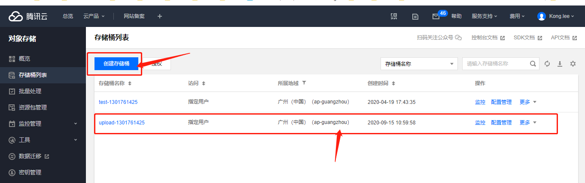
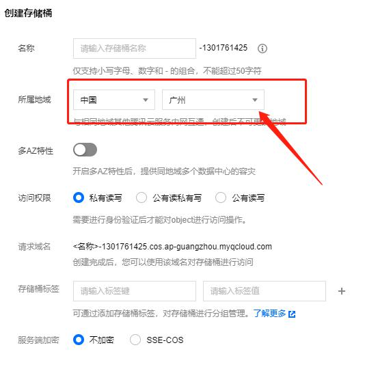
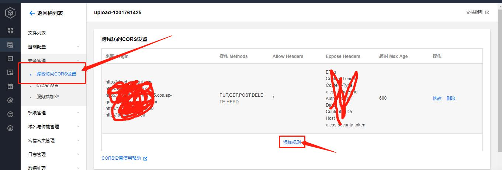

## 文件上传的几种形式
#### 使用读取文件的形式FileReader对象
* 原理是利用Input的type="file"先上传文件，让代码和文件关联，获取files列表，然后通过FileReader读取文件并转码成base64
* 其中reader.result.split(',')[1]和e.target.result都能拿到视频的转码
* 注意上传图片的时候要限定为图片格式
```
if(!/image\/\w+/.test(file.type)){
    alert("请确保文件为图像类型");
    return false;
}
```
```
const inp = useRef(null)
const test = (e)=>{
    let file = inp.current.files[0]
    /*
    初始化一个FileReader 对象
    */
    const reader= new FileReader()
    /*
    开始读取指定的Blob中的内容。一旦完成，result属性中将包含一个data: URL格式的字符串以表示所读取文件的内容。
    */
    reader.readAsDataURL(file)
    /*
    在读取后，触发的事件，并获取读取文件的地址
    */
    reader.onload = (e) => {
      let base64Str = reader.result.split(',')[1]
      console.log("sss",reader.result)
      console.log("e",e)
      console.log("e.target.result",e.target.result)
      console.log("base64Str",base64Str)
      setGetVideo(base64Str)
    }
  }
  
//html
<input ref={inp} onChange={(files)=>test(files)} type="file"></input>
```
* 其中FileReader的一些方法和事件
```
(1) FileReader.abort()
作用：中止读取操作。
(2) FileReader.readAsArrayBuffer()
作用： 开始读取指定的Blob中的内容，一旦完成，result属性中保存的将是被读取文件的ArrayBuffer数据对象。
(3) FileReader.readAsBinaryString()
作用： 开始读取指定的Blob中的内容，一旦完成，result属性中将包含所读取文件的原始二进制数据。
(4) FileReader.readAsDataURL()
作用：开始读取指定的Blob中的内容，一旦完成，result属性中将包含一个data: URL格式的字符串以表示所读取文件的内容。此方法较为常用。
(5) FileReader.readAsText()
作用： 开始读取指定的Blob中的内容，一旦完成，result属性中将包含一个字符串以表示所读取的文件内容。
```
* 事件
```
(1) FileReader.onabort
作用： 该事件在读取操作被中断时触发。
(2) FileReader.onerror
作用： 该事件在读取操作发生错误时触发。
(3) FileReader.onload
作用： 该事件在读取操作完成时触发。该事件较为常用。
(4) FileReader.onloadstart
作用： 该事件在读取操作开始时触发。
(5) FileReader.onloadend
作用： 该事件在读取操作结束时（要么成功，要么失败）触发。
(6) FileReader.onprogress
作用：该事件在读取Blob时触发。
```
#### 通过form表单上传
```
<div>
    <form action="http://192.168.1.109:8080/upFileLoad" enctype="multipart/form-data" method="post">
        <input type="file" name="getfile" onChange={(e)=>onFile(e)}/>
        <input type="submit" onChange={(e)=>onGo(e)}/>  
    </form>
</div>
```
## 通过腾讯云COS实现简单上传和分块上传
> 接入COS主要有两种方法，一个是API接入(强烈不推荐)，第二个是使用sdk(推荐)
```
1.使用API接入的时候会更加依赖后台，因为每次使用一次API都需要刷新Authorization的签名
而且生产签名的参数有时候是不一样的，亲测很繁琐而且不好使用，慎用...

2.使用SDK接入则内部已经会把签名封装好放在请求头，默认只需要使用里面的方法即可，这就非常的友好
只需要从后台拿一个临时密钥即可，其他操作前端都可以自主完成，然后最后把产品链接发给后台即可
```
* 第一种API接入不推荐，所以这里就直接演示的是sdk的基本操作，比较通吃还简单，如果一定需要使用API接入的
* 可以查看文档进行操作[](https://cloud.tencent.com/document/product/436/7749)
#### COS实现大文件分块上传，小文件简单上传
* 文档地址[](https://cloud.tencent.com/document/product/436/11459)
* 在使用SDK之前需要在COS桶中进行配置跨域功能，登录[腾讯云COS控制台](https://console.cloud.tencent.com/cos5)
* 然后在存储桶控制台列表中创建一个新的创建存储桶

> 这里有一个所属地区，选一个最靠近自己地理位置的地点，这个选择会影响拉取COS桶的时间
> 例如选择了中国-广州  后面在选择地域的时候Region 值则是ap-guangzhou，在COS桶的详细信息中会有描述

* 然后点击刚刚新建的COS桶，选择左侧列表中的安全管理--> 跨域访问CORS设置
